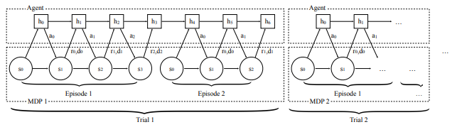

# : Fast Reinforcement Learning via Slow Reinforcement Learning

# Summary of the Paper

_Title: : Fast Reinforcement Learning via Slow Reinforcement Learning_
_Authors: Yan Duan, John Schulman, Xi Chen, Peter L. Bartlett, Ilya Sutskever, Pieter Abbeel_

The paper proposes the use of recurrent models (GRUs) as meta learners across different RL tasks (essentially, different MDPs). This helps incorporate priors into the learning task. The authors propose this as an attempt to alleviate the following problems:

- High sample complexity of RL algorithms
- Need of tailoring domain-specific reinforcement learning algorithms

The approach consists of sampling an MDP from a distribution of MDPs $\mathcal{M}$. Learning on each MDP is referred to as a trial and each trial consists of a fixed number of episodes. After every time step in an episode, the next state, action (that lead to that state), reward (corresponding to the action), and the termination flags are passed to the agent (policy) as input which generates a new hidden state, and the next action from the policy conditioned on the previous hidden states. The hidden states are retained across different episodes of the same task but aren't retained across different tasks. The algorithm used in the paper is TRPO and the approach is evaluated on two fairly simple tasks: Multi-armed bandits and a Tabular RL setting and on a Visual Navigation setting (VizDom) showing that this meta-reinforcement learning algorithm can scale to fairly complex tasks. Another paper (Learning to Reinforcement Learn)$^{[1]}$ from Deepmind published shortly after this proposes a very similar approach for meta reinforcement learning. 

                                              Procedure of Environment Agent Interaction$^{[2]}$

# Notebook Setup Details

- Connect to Google Drive File System [Optional] for saving logs (run cell 1)
- Install wandb for python (run cell 2)
- The metric for all the runs, experiments, and ablations can be monitored in real-time via [wandb.ai](https://wandb.ai/home) - plots have been included in the notebook anyway for convenience
- Kindly refer to the notebook for details on hyperparameters used for all the experiments

# Implementation Details

- Exponential Moving Averages have been used to smoothen the plots for the experiments and ablations.
- Proximal Policy Optimisation (PPO) with clipping (PPO-Clip) with a GRU Policy has been used as the reinforcement learning algorithm (instead of TRPO which has been used in the original paper).

## Environment (Tasks)

- A simple tabular environment taken and modified from [TabulaRL](https://github.com/iosband/TabulaRL/blob/master/src/environment.py) has been used for all the experiments and ablations
- A modified riverSwim$^{[3]}$ task has been used throughout the notebook.
    - Number of States used = 10 (Can be changed)
    - Number of actions per state = 2 (Property of the environment)
    - Episode Length used = 20 (Can be changed)
    - Distribution over tasks
        - The rewards are sampled from a uniform distributions between 0.001 and 0.009
        - State transition probabilities are sampled from a uniform distribution between 0 and 1.
        - Refer to the code for more details (Cell 4)

## GRU Policy

- A GRUPolicy is defined for use with PPO and RL2
- The policy takes in observation(one-hot vector), action(one-hot vector), reward, and episode termination flag as an input and produces a new hidden state and next action conditioned on the previous hidden state.
- For the first time step of each task, hidden state and action for the first time step are taken as zero tensors of the appropriate dimensions, and reward and episode and termination flags are considered as 0s.

## PPOGRU

- PPO agent adapted to work with a GRU Policy
- Training is done over multiple epochs, each epoch running multiple episodes. Policy and Value functions are updated after each epoch
- The rewards, policy loss and value loss are logged using wandb and can be monitored in real-time.
- This policy is trained on a riverSwim MDP task producing an average reward of 0.11 when evaluated.

                                               

## RL2

- This is a class for implementing the meta-reinforcement learning algorithm
- It has been designed to work with both GRU and MLP policies for the PPO agent to facilitate ablations
- It takes in the policy type (mlp or recurrent), some policy parameters and a function for sampling different MDPs for the riverSwim task as the initialization parameters.

## Experiments

### Experiment 1 : Running RL2 for different number of trials

RL$^2$ is used for meta training PPO (GRUPolicy) for different number of trials (n = 10, 25, 50, 75) and the meta trained policy is then meta tested (trained on a riverSwim environment) and the performance is compared. Each trial consists of 5 epochs, each epoch containing 2 episodes, which run for 20 time steps each as mentioned before. The following plot shows the (training) performance of RL2 on different number of trials along with the trained performance of a simple (not using meta learning)  PPO with GRU Policy for reference.

RL2 performs best for n = 10 trials which agrees with the paper and the performance decreases thereafter with increasing number of trials which also agrees with the paper. This happens because the outer reinforcement learning problem becomes more complicated with increasing number of trials. However, the performance of RL2 is better than most for n=75 which is not consistent with the results shown in the original paper. One explanation to this might be that since, the tasks that we are using are fairly simple (only 2 actions per state and only 20 time steps per episode), the agent learns to memorize the learning procedure (essentially overfitting the outer loop task) due to the higher number of trials

### Experiment 2 : Running RL2 for across different number of episodes per trial

RL$^{2}$ is used for meta training PPO (GRUPolicy) for different numbers of episodes per epoch (2, 5, 10 and 15 episodes per epoch ⇒ 10, 25, 50 and 75 episodes per task) and then meta tested (trained on a riverSwim environment) and the performance is compared. RL$^{2}$ is run for 10 trials (10 different tasks) in each of the above cases. The given plot shows the performance for different episodes per epoch along with the performance of simple (not Meta Trained) PPO (with GRU Policy).

10 episodes per Task (MDP) works best and the performance decreases thereafter with increasing number of episodes per MDP. Same reason as used to explain the observations in Experiment 1 can be used to explain this observation as well.

## Ablations

### Ablation 1: Running RL$^{2}$ without resetting the hidden state across different tasks

The original paper proposes that the hidden state be reset across different tasks. Here, RL$^{2}$ has been used without resetting the hidden states between different tasks (RL2 No Reset). It has been compared with policy normally (meta) trained using RL$^{2}$ (Vanilla RL2) and with a normal PPO agent with GRU Policy (PPO GRUPolicy)

The algorithms still works but the performance is significantly poorer than normal RL$^{2}$, at times even worse than normal PPO with a recurrent policy

### Ablation 2: Running RL$^2$ with vanilla MLP Policy

We drop the GRU Policy and run RL$^2$ on an agent using a Vanilla MLP Policy Instead. The performance of PPO trained (not using meta learning) on the environment using an MLP Policy is as shown. The chosen MLP Policy (1 hidden layer of size 32) converges faster than a GRU Policy. 

Intuitively, the result should be that the algorithm wouldn't work at all or at least, will perform poorer (it might work since the policy is still meta-learning by training over different tasks) than the GRU Policy. However, the actual results are counterintuitive. 

RL$^2$ using MLP Policy not only works but in fact, it works better than RL$^2$ with GRU Policy (for the same training time). One reason for this might be that this is due to the fact that the chosen MLP Policy (one hidden layer of size 32) works better than the chosen GRU Policy (hidden size 4) in general. Experimenting with different hidden size might give better performances. However, we can safely conclude that RL$^2$ works even without a GRU Policy. Although, it is arguable that the approach can be called RL$^2$  anymore since the main essence of the algorithm (using recurrent policies) has been removed. It can simply be regarded as pre-training over similar tasks. It remains to investigate whether this performance(RL$^2$ with MLP Policy) can scale to more complex tasks and when the MDPs in the distribution are significantly different (for eg. when the distribution is not just over the rewards and transition probabilities but also the state distribution is different or when the rewards are stochastic, etc.)

# References

[1] Wang, JX, et. al., Learning to Reinforcement Learn, 2017

[2] Duan, Yan, et. al., RL$^{[2]}$: Fast Reinforcement Learning via Slow Reinforcement Learning, 2016

[3] Osband, Ian, et. al., (More) Efficient Reinforcement Learning via Posterior Sampling, 2013

# Other Open Source Implementations of RL$^{2}$

- [Garage](https://garage.readthedocs.io/en/latest/user/algo_rl2.html)